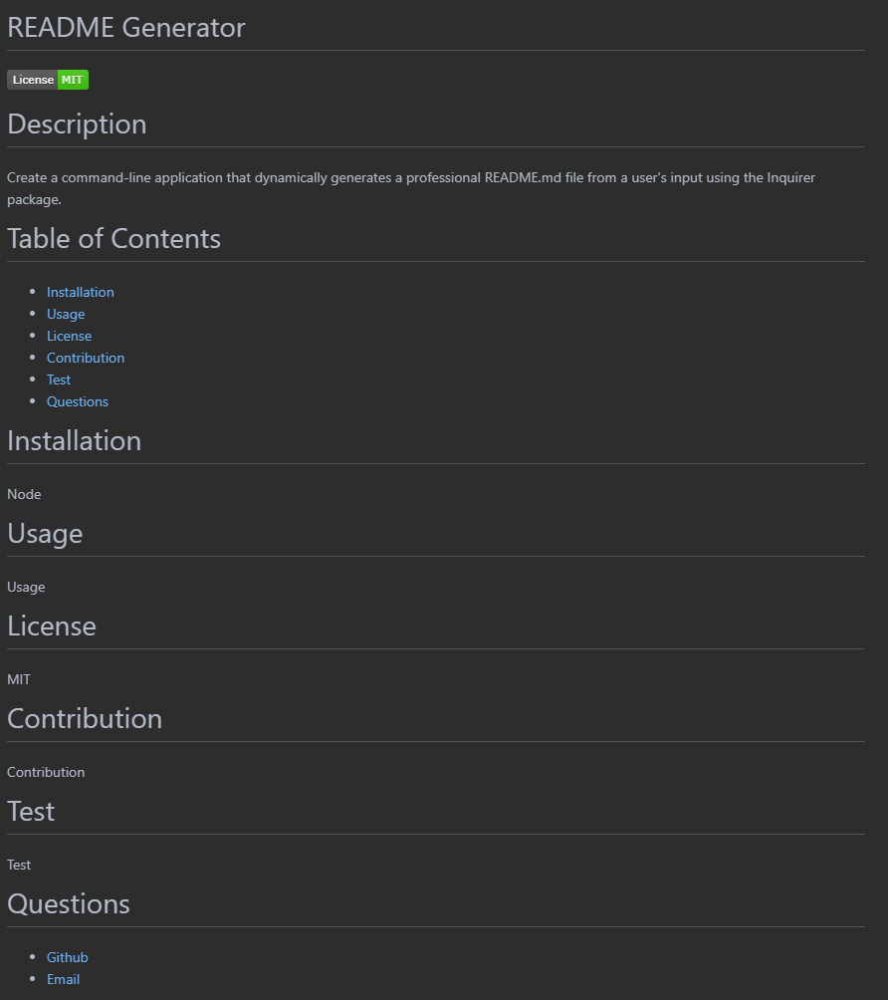

# Description

In this assignment, our task was to create a command-line application that dynamically generates a professional README.md file from a user's input using the [Inquirer package](https://www.npmjs.com/package/inquirer).

When the user runs the application in a command-line application, they are prompted to enter a project title, description, installation instructions, usage information, contribution guidelines, test instructions, license information, and contact information.

Then a README.md file is generated with the title of the project and sections entitled Description, Table of Contents, Installation, Usage, License, Contributing, Tests, and Questions. The information provided by the user is also added to the respective sections.

JavaScript | Node.js

# Screenshot

# Link

[Video demonstration](https://drive.google.com/file/d/1WtOMvgSKOMH2ZiuskvM6NBqWTPwuBlyb/view?usp=sharing)
